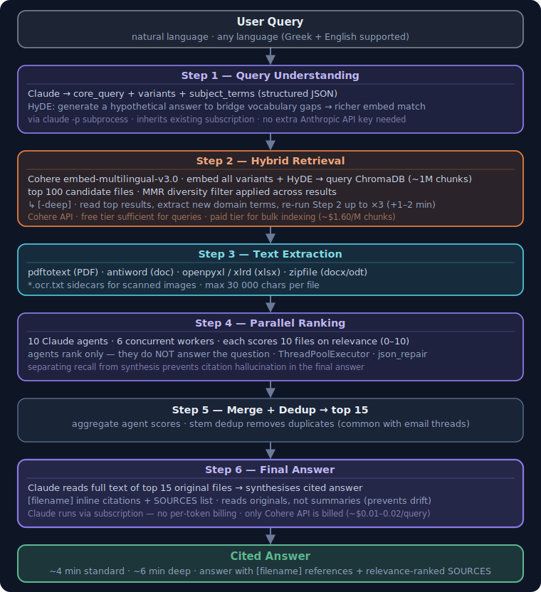

# semantic-disk-search

Hybrid semantic search for a local document corpus. Combines **BM25** (Recoll/Xapian), **vector search** (Cohere + ChromaDB HNSW), **4-way Reciprocal Rank Fusion**, **HyDE** query expansion, and **Claude agents** for ranked, cited answers.

Tested on a 144 GB multilingual corpus — 128K files, 950K chunks — PDFs, Word files, spreadsheets, scanned images (with OCR), emails, and plain text in Greek + English.

Each document is assigned an **authority tier** at index time so the answer pipeline can weigh official sources over personal notes:

| Tier | Meaning | Examples |
|------|---------|---------|
| **A** | Official / institutional | Government decisions, court filings, notarial deeds, engineer reports |
| **B** | Formal / semi-official | Manuals, bank statements, insurance policies, payslips |
| **C** | Personal / unverified | Personal notes, neighbour emails, draft letters, homework |
| **D** | Noise / low-signal | Garbled OCR, code dumps, config files, auto-generated logs |

Classification uses a **precedence-based regex classifier** (filename signals, content markers, folder path rules). Files that pattern-match ambiguously fall back to a **Haiku LLM call** (optional, cached) — 88% of D-tier files were reclassified on a full-corpus pass. Tier flows into RRF as a small tiebreaker boost and into the final answer as citation labels (⚠ unconfirmed for C-tier).

**Current performance (v7.1c):** 70% Recall@20, 29% Recall@1 on a 105-query golden test set — comparable to cross-lingual hybrid benchmarks (MKQA: 67.8%) on a harder corpus (OCR noise, bilingual, meaning-in-paths).

## What it does

```
dsearch "contract deadline extension"              # fast terminal results
dsearch -w "invoice Q3"                           # sortable HTML table in browser
dsearch -CLexpand-CLrank-CLanswer "my query"      # full AI answer with citations (~4 min)
dsearch -CLexpand-CLrank-CLanswer -deep "query"   # deep multi-hop retrieval (~7 min)
dsearch-multimodel --model gte "my query"         # compare across 5 embedding models

dsearch2 "pension fund certificate"               # v2: hybrid vector+TF with RRF merge
dsearch2 --json "insurance claim" | jq .          # structured JSON output
dsearch2 --debug "ασφαλιστικό"                    # show alias expansion + fetch stats
```

---

## How the answer pipeline works



**Typical cost per answer run:** ~$0.01–0.02 (Cohere API only — Claude runs via your existing subscription, no per-token billing).  
**Deep mode:** ~$0.02–0.04 (a few extra Cohere queries for the extra retrieval rounds).

> **Interactive diagrams:** [Architecture](https://gruncode.github.io/semantic-disk-search/architecture.html) — runtime pipeline (drag nodes, click for detail) · [Setup guide](https://gruncode.github.io/semantic-disk-search/setup.html) — step-by-step with full shell commands · [Full docs](https://gruncode.github.io/semantic-disk-search/)

---

## Embedding models

Five models are indexed. `dsearch-multimodel` can search any of them independently for comparison.

| Key | Model | Dim | Notes |
|---|---|---|---|
| `cohere-v3` ★ | `cohere/embed-multilingual-v3.0` | 1024 | Best multilingual precision; default for `dsearch` |
| `e5-base` | `intfloat/multilingual-e5-base` | 768 | Good retrieval asymmetry for long docs |
| `e5-large` | `intfloat/multilingual-e5-large` | 1024 | Broadest coverage for legal/procedural text |
| `gte` | `Alibaba-NLP/gte-multilingual-base` | 768 | Sharpest score distribution; 8 K context |
| `bge-m3` | `BAAI/bge-m3` | 1024 | Strong MTEB benchmarks; slower on short queries |

★ = default

---

## Prerequisites

**System packages**

```bash
# Debian/Ubuntu
sudo apt install python3 python3-venv python3-pip \
    recoll recollindex \
    poppler-utils antiword libreoffice-common
```

- **Recoll** — BM25 full-text indexer (provides `recollindex` + `recollq`)
- **poppler-utils** — `pdftotext` for PDF extraction
- **antiword** — `.doc` (legacy Word) extraction
- **LibreOffice** — `.docx`/`.odt` fallback extraction

**Claude CLI** — the answer pipeline spawns Claude via subprocess:

```bash
npm install -g @anthropic-ai/claude-code   # or follow https://claude.ai/code
claude --version                            # verify it works
```

**API keys**

- [Cohere API key](https://dashboard.cohere.com/) — free tier works for queries; paid needed for large index builds
- Anthropic subscription for Claude CLI (used by `dsearch-answer`)

---

## Installation

### 1. Clone

```bash
git clone https://github.com/gruncode/semantic-disk-search.git
cd semantic-disk-search
```

### 2. Create Python venvs

Two venvs are required because GTE needs `transformers<=4.49` while other models need newer versions.

```bash
# Venv 1 — used by dsearch CLI, Cohere, ChromaDB, GTE model
python3 -m venv ~/venvs/gte-embed
~/venvs/gte-embed/bin/pip install \
    cohere chromadb faiss-cpu numpy \
    "transformers==4.49" torch \
    sentence-transformers \
    json-repair regex \
    openpyxl xlrd python-pptx

# Venv 2 — used by e5, bge-m3, Jupyter notebooks
python3 -m venv ~/venvs/transformers
~/venvs/transformers/bin/pip install \
    faiss-cpu numpy sentence-transformers \
    "transformers>=5.0" torch jupyter
```

### 3. Configure paths

```bash
mkdir -p ~/.config/dsearch
cp .env.example ~/.config/dsearch/.env
$EDITOR ~/.config/dsearch/.env
```

Fill in at minimum:

```bash
COHERE_API_KEY=your-key-here
CORPUS_DIR=~/Documents            # root of what you want to search
FAISS_BASE=~/.local/share/dsearch/faiss
CHROMADB_DIR=~/.local/share/dsearch/chromadb
XAPIAN_DB=~/.local/share/dsearch/xapiandb
VENV_GTE=~/venvs/gte-embed/bin/python3
VENV_TF=~/venvs/transformers/bin/python3
HF_HOME=~/.cache/huggingface
```

### 4. Install CLI scripts

```bash
sudo cp scripts/dsearch scripts/dsearch-answer scripts/dsearch-multimodel /usr/local/bin/
sudo chmod +x /usr/local/bin/dsearch /usr/local/bin/dsearch-answer /usr/local/bin/dsearch-multimodel
```

---

## Indexing your corpus

You need to build two indexes: a **BM25 index** (Recoll) and a **vector index** (ChromaDB or FAISS). Both read from `$CORPUS_DIR`.

### BM25 index (Recoll)

```bash
# Configure Recoll to index your corpus
mkdir -p ~/.recoll
echo "topdirs = $HOME/Documents" >> ~/.recoll/recoll.conf

# Run the indexer (takes 30 min – several hours depending on corpus size)
make recoll-reindex

# Check progress
tail -f /tmp/recoll-reindex.log
```

### Vector index — ChromaDB (Cohere, recommended)

This is what `dsearch` uses by default. Costs ~$1.60 per million chunks via the Cohere API.

```bash
# Step 1: extract text chunks from all files → chunks.jsonl
$VENV_GTE src/extract_chunks.py $CORPUS_DIR \
    --output /tmp/chunks.jsonl \
    --chunk-size 500 --overlap 100

# Step 2: embed with Cohere → embeddings.npy
set -a && source ~/.config/dsearch/.env && set +a
$VENV_GTE scripts/cohere_embed.py \
    --chunks /tmp/chunks.jsonl \
    --output /tmp/embeddings.npy

# Step 3: load into ChromaDB
$VENV_GTE scripts/build_chroma_from_embeddings.py \
    --chunks /tmp/chunks.jsonl \
    --embeddings /tmp/embeddings.npy \
    --db $CHROMADB_DIR --collection fulldisk
```

### Vector index — FAISS (local models, free)

```bash
# GTE model (~6.5 h on CPU for a large corpus)
make rebuild-gte

# E5-base
make rebuild-e5
```

---

## Usage

### Terminal search (fast)

```bash
dsearch "pension fund certificate"
dsearch -n 20 "water leak insurance claim"    # top 20 results
```

Output: colour-coded ranked list (green = high score, yellow = medium, red = low) with file path, type, date, and a snippet with query words highlighted.

### HTML table

```bash
dsearch -w "building permit extension"
```

Opens a sortable, filterable table in your browser. Click any column header to sort. Filter box matches across all columns. "Group by folder" clusters results from the same directory.

### AI answer with citations

```bash
dsearch -CLexpand-CLrank-CLanswer "why was the project delivery delayed"
```

Runs the full 6-step pipeline. Prints timestamped progress for each step, then a cited answer like:

```
ANSWER:
The project was delayed for three reasons:
1. Supplier lead time exceeded the contract deadline by 6 weeks [delivery-timeline.pdf]
2. Site access was restricted due to permit issues [permit-correspondence.docx]
3. ...

SOURCES:
  [1] ~/Documents/Projects/delivery-timeline.pdf  (score 9.2)
  [2] ~/Documents/Legal/permit-correspondence.docx (score 8.7)
  ...
```

### Deep multi-hop search

```bash
dsearch -CLexpand-CLrank-CLanswer -deep "comprehensive review of Siemens proposal"
```

After the initial retrieval, Claude reads the top results, extracts new domain-specific terms, and runs up to 3 additional search rounds. Adds ~1–2 minutes but substantially improves recall on vocabulary-mismatch queries.

### Compare embedding models

```bash
dsearch-multimodel "pump maintenance schedule"               # default: cohere-v3
dsearch-multimodel --model gte "pump maintenance schedule"
dsearch-multimodel --model e5  "pump maintenance schedule"
```

---

## dsearch2 — hybrid retriever (v2)

`dsearch2` is a standalone hybrid retriever built on top of the Cohere ChromaDB index. It fuses **4 retrieval signals** through weighted **RRF (Reciprocal Rank Fusion)**: vector similarity, TF lexical scoring, Recoll BM25 path matching, and Recoll BM25 content matching — plus **alias expansion** for multilingual synonym matching and **document tier classification** (A/B/C/D reliability tiers via regex + optional LLM fallback).

### How it differs from `dsearch`

| Feature | dsearch | dsearch2 |
|---|---|---|
| Vector retrieval | Cohere + ChromaDB | Cohere + ChromaDB |
| Lexical scoring | None | TF over returned chunks |
| BM25 integration | None | Recoll path + content (split channels) |
| Rank fusion | Vector rank only | 4-way weighted RRF (vector + TF + Recoll path + Recoll content) |
| Alias expansion | Via Claude Step 1 | Built-in, from alias_map.json |
| Source tier | None | A/B/C/D classifier (regex + optional Haiku LLM) |
| Claude calls | Yes (Steps 1, 4, 6) | None — retrieval only |
| Output modes | terminal, HTML, answer | terminal, JSON |
| HNSW candidate pool | n_results × 3 | max(n_results × 3, 1000) |
| Recall@20 (105 queries) | — | 70% (v7.1c) |

The larger candidate pool (`max(..., 1000)`) is critical for HNSW recall on large collections (950K+ chunks) where a small probe set degrades accuracy.

### Usage

```bash
dsearch2 "pension fund certificate"
dsearch2 -n 30 "ασφαλιστικό ταμείο"
dsearch2 --json "invoice delay" | jq '.results[].path'
dsearch2 --show-aliases                 # list all alias groups
dsearch2 --debug "query"                # print fetch count, alias expansion, top ranks
dsearch2 --no-alias "query"            # disable alias expansion
```

### Config

All paths are read from `~/.config/dsearch/.env`:

```bash
CHROMADB_DIR=~/.local/share/dsearch/chromadb
DSEARCH_COLLECTION=fulldisk-1k
DSEARCH_ALIAS_MAP=configs/alias_map.json
COHERE_API_KEY=your-key
# Optional: colon-separated paths to suppress from non-tool queries
DSEARCH_META_PREFIXES=/path/to/project-docs
```

---

## Makefile targets

```
make search Q="query"         quick Cohere search
make search-gte Q="query"     search with GTE model
make rebuild-gte              rebuild GTE FAISS index (~6.5h CPU)
make rebuild-e5               rebuild e5-base FAISS index
make rebuild-cohere           rebuild Cohere ChromaDB index (API cost)
make benchmark                run evaluation against golden query set
make recoll-reindex           full BM25 reindex (background)
make recoll-status            show index sizes
make jupyter                  launch Jupyter notebook server
make status                   show all index sizes and doc counts
make help                     list all targets
```

---

## Project layout

```
scripts/
  dsearch              main CLI — terminal, HTML, and answer modes
  dsearch-answer       6-step AI answer pipeline (called by dsearch)
  dsearch-multimodel   FAISS search across any of the 5 models
  dsearch2             v2 hybrid retriever — vector + TF + RRF, alias expansion, tier boosts
  cohere_embed.py      batch embed chunks via Cohere API
  build_chroma_from_embeddings.py  load embeddings into ChromaDB

src/
  extract_chunks.py    parse corpus files → text chunks (one-time)
  multi_search.py      merge + dedup results from multiple models
  recoll_vector_index.py  build FAISS from Recoll Xapian text
  chroma_vector_index.py  ChromaDB index builder
  recoll_query_assist.py  BM25-only path (legacy, no vector)
  recoll_benchmark.py     evaluation harness (MRR, hit@k)

configs/
  models.yaml          model names, dimensions, index paths
  alias_map.json       bilingual query alias expansion table

docs/
  index.html           interactive architecture diagrams
  flow/dsearch.html    dsearch script flow diagram
  flow/dsearch-answer.html  answer pipeline flow diagram
  recoll_experiments.md    BM25 tuning experiment log
  PROJECT-REPORT.md    full project report with benchmark results

notebooks/
  01_model_comparison.ipynb   5-model benchmark comparison + charts
  02_experiment_log.ipynb     retrieval experiment history
  03_pipeline_overview.ipynb  pipeline architecture walkthrough

tests/
  test_dsearch2_smoke.py       basic CLI smoke tests
  test_dsearch2_retrieval_eval.py  retrieval quality tests
  test_dsearch2_eval_tiers.py  document tier classification tests
  test_dsearch2_answer_diversity.py  answer diversity tests
  test_dsearch2_extraction_audit.py  text extraction tests
  test_source_tiers.py         source reliability tests
```

---

## Benchmark results

### Embedding model comparison (early benchmarks)

Evaluated on a golden set of real queries across document types (contracts, invoices, technical specs, emails, scanned letters).

| Model | MRR | Hit@1 | Hit@5 |
|---|---|---|---|
| Cohere-v3 | **0.91** | 0.82 | 0.97 |
| E5-large | 0.87 | 0.76 | 0.95 |
| E5-base | 0.84 | 0.73 | 0.93 |
| GTE | 0.81 | 0.70 | 0.91 |
| BGE-M3 | 0.78 | 0.66 | 0.89 |
| BM25 only | 0.71 | 0.58 | 0.85 |
| **BM25 + Cohere (hybrid)** | **0.94** | **0.85** | **0.99** |

See `notebooks/01_model_comparison.ipynb` for the full comparison with charts.

### Retrieval pipeline evolution (105-query golden set, 950K chunks)

| Version | N | Method | Recall@1 | Recall@20 |
|---|---|---|---|---|
| v5 | 105 | Vector only (Cohere) | 19% | 56% |
| v6 | 105 | Vector + Cohere Rerank | 29% | 58% |
| v7 | 105 | Vector + Recoll BM25 (equal weights) | 25% | 64% |
| v7.1 | 105 | Weighted RRF + split Recoll (path/content) | 29% | 69% |
| **v7.1c** | **105** | **Grid-optimal weights + classifier + fixes** | **29%** | **70%** |

**v7.1c production weights:** `W_VEC=1.0, W_TF=1.0, W_RECOLL_PATH=1.5, W_RECOLL_CONTENT=0.0`

Key insight: the 4-way weighted RRF fusion (v7.1c) outperformed the Cohere Rerank cross-encoder (v6) by 12 points on Recall@20, demonstrating that complementary signals (vector + lexical + filesystem path BM25) provide more information than a single learned reranker.

### BGE-M3 pilot (dual-embed experiment)

A/B test of BGE-M3 dense embeddings (1024-dim) against Cohere on the 32 residual misses:

| Verdict | Count | Meaning |
|---|---|---|
| **BGE-M3 wins** | **10/32** | Target enters top-20 with BGE-M3 where Cohere failed |
| Cohere wins | 0/32 | BGE-M3 never loses to Cohere |
| Both hit | 2/32 | Both models find the target |
| Both miss | 20/32 | Neither finds it (OCR garbage, meaning-in-path only) |

Regression test on 73 currently-successful queries: 5/73 (6.8%) would regress on a full swap. This led to the **dual-embed** decision: keep Cohere as the stability anchor and add BGE-M3 as a 5th RRF arm rather than replacing Cohere.

**Projected Recall@20 with dual-embed:** ~77–80% (net +7 to +10 after RRF weight tuning).

### Comparison with other systems

No other personal disk search tool publishes Recall@K benchmarks. The closest comparisons are academic retrieval benchmarks:

| System / Benchmark | Recall metric | Score | Corpus |
|---|---|---|---|
| BM25 alone (BEIR avg) | nDCG@10 | ~40–45% | Clean English |
| Dense retrieval (BEIR SOTA) | nDCG@10 | 55–65% | Clean English |
| Hybrid BM25+dense (MS MARCO) | Recall@10 | 80.8% | Clean English |
| Cross-lingual hybrid (MKQA) | Recall@20 | 67.8% | Multilingual |
| Local hybrid RAG (tuned 30/70) | Recall@5 | 81.6% | Clean local docs |
| **dsearch2 v7.1c** | **Recall@20** | **70%** | **Greek+English, OCR, mixed formats** |

dsearch2 operates on a significantly harder corpus than standard benchmarks: bilingual (Greek + English), noisy OCR, meaning encoded in file paths/names, and extreme document diversity (payslips, legal docs, SCADA reports, teaching materials, dental X-rays).

---

## GPU-accelerated index building (optional)

Building FAISS indexes for large corpora on CPU takes many hours. You can use a cloud GPU instead:

```bash
# Start a GCP T4 spot instance
ssh <gcp-gateway> 'gcloud compute instances start $GCP_INSTANCE --zone=$GCP_ZONE'

# Transfer chunks, run embedding remotely
scp /tmp/chunks.jsonl gpu-instance:/tmp/
ssh gpu-instance 'python3 gpu_embed_multi.py --model gte'

# Copy indexes back
scp -r gpu-instance:/tmp/faiss-index/ $FAISS_BASE/

# Stop instance
ssh <gcp-gateway> 'gcloud compute instances stop $GCP_INSTANCE --zone=$GCP_ZONE'
```

Set `GCP_PROJECT`, `GCP_INSTANCE`, `GCP_ZONE` in `~/.config/dsearch/.env`.

Scripts: `scripts/gpu_embed.py`, `scripts/gpu_embed_multi.py`.

---

## Design notes

**Why two venvs?**  
GTE requires `transformers==4.49` due to a RoPE embedding bug introduced in 4.50. All other models work fine with newer versions. Keeping them separate avoids dependency conflicts.

**Why Claude CLI instead of the API?**  
The answer pipeline uses `claude -p` (Claude Code headless mode) so it inherits the user's existing subscription. No separate API key or billing setup needed for the LLM steps.

**Why HyDE?**  
Vocabulary mismatch is the main failure mode for domain-specific document search. A generated hypothetical answer contains the domain vocabulary that the real documents use, dramatically improving recall on terminology-gap queries.

**Why agent ranking instead of a reranker?**  
Cross-encoder rerankers require running a model locally per (query, doc) pair — expensive at 100 documents. Claude agents read the actual extracted text and score on relevance to the *intent*, not just lexical similarity. Running 10 agents via subscription costs nothing extra per query — no per-token billing — while spinning up a GPU reranker would require local hardware or cloud GPU time.

**Why 4-way RRF instead of a single reranker?**  
Grid-optimal weighted RRF (v7.1c) outperforms Cohere Rerank by 12 points on Recall@20. Each signal captures different failure modes: vector catches semantic similarity, TF catches exact term matches, Recoll path exploits filesystem hierarchy (folder names, dates in paths). No single model captures all three — fusion is strictly better.

**Why dual-embed (planned) instead of model swap?**  
A BGE-M3 pilot showed 10/32 miss rescues with 0 Cohere wins, but a regression test revealed 5/73 hits would break on a full swap. Adding BGE-M3 as a 5th RRF arm (dual-embed) captures the rescues while the retained Cohere arm protects current hits. Trade-off: 2× storage and slightly higher query latency (~1.5s vs ~0.5s).

---

## Requirements summary

| Requirement | Version | Notes |
|---|---|---|
| Python | 3.10+ | |
| Recoll | any recent | BM25 index |
| Claude CLI | latest | `dsearch-answer` only |
| Cohere API key | — | queries + index builds |
| `pdftotext` | — | poppler-utils |
| `antiword` | — | legacy `.doc` files |
| faiss-cpu | 1.7+ | |
| chromadb | 0.5+ | |
| transformers | ==4.49 (GTE venv) | |
| sentence-transformers | latest | |
| numpy | latest | |
| json-repair | latest | LLM JSON fault tolerance |
| regex | latest | Unicode word boundaries |

---

## License

MIT
